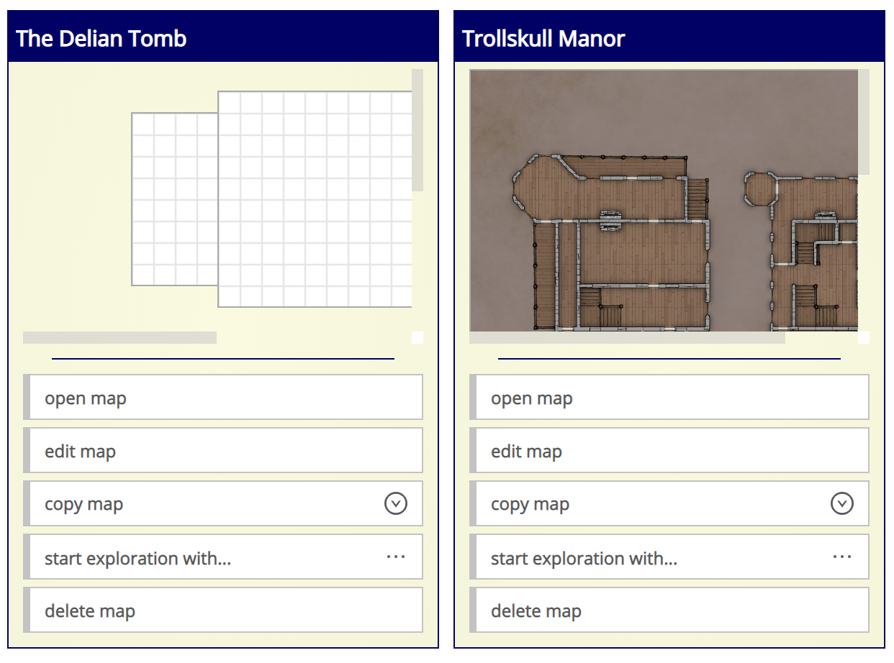
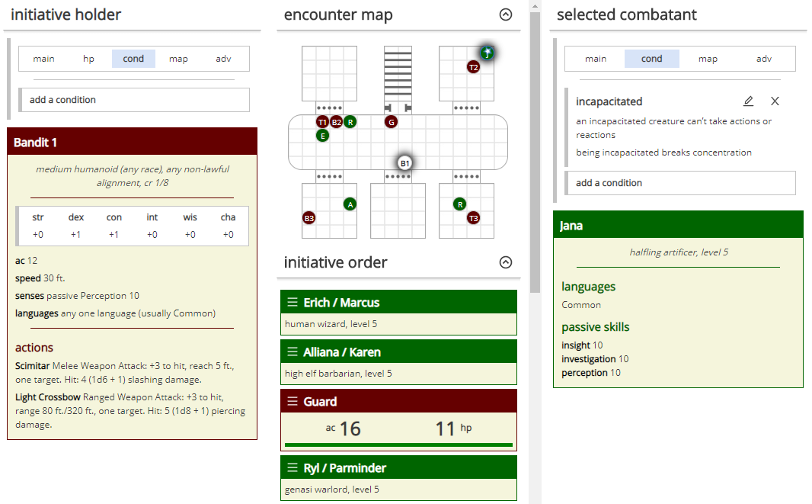
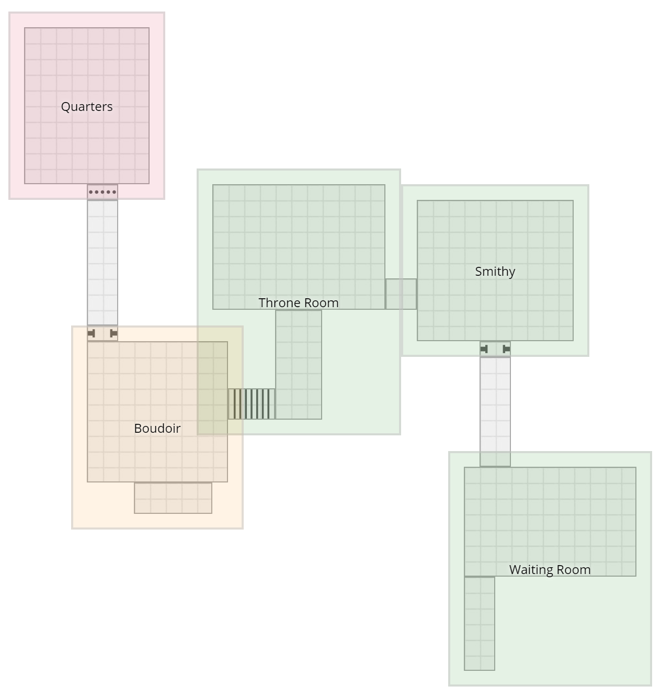
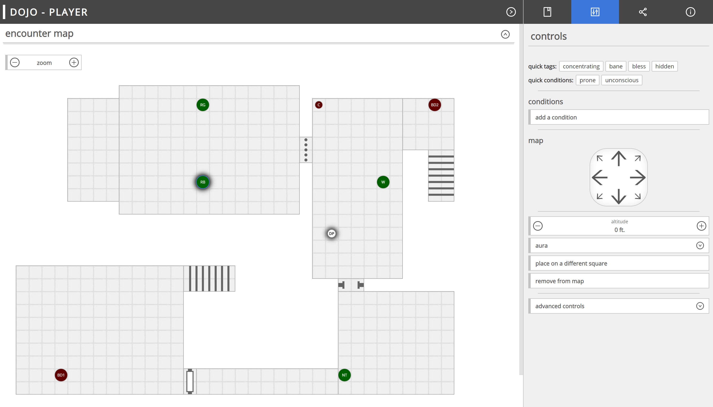
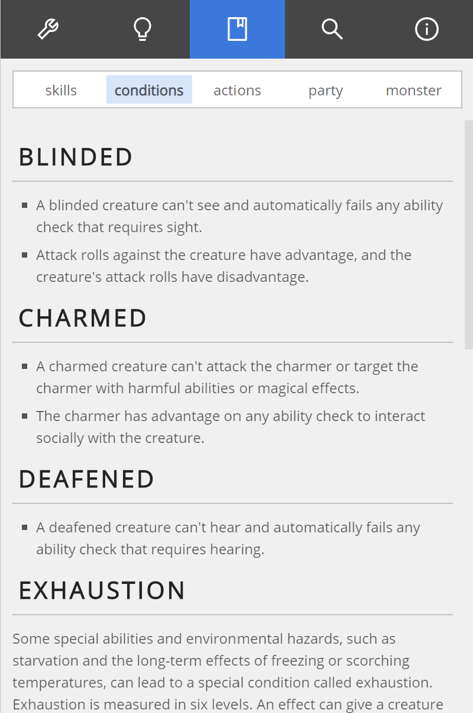

# dojo

Dojo is a web app for D&D (5E) dungeon masters.

You can find it at [https://andyaiken.github.io/dojo/](https://andyaiken.github.io/dojo/).

If you would like to contribute to development, have a look [here](contributing.md).

## Features

### Monster Designer

You can build your own monsters with the built-in monster designer, which lets you check your creations against other similar monsters. Or you can let the app do it for you - just select a few monsters and let it splice them together into a new hybrid monster.

The app comes with all the standard monsters from the official D&D system reference document, and you can also quickly import a monster from D&D Beyond.

### Encounter Builder

The encounter builder allows you to build combat encounters, and even split an encounter into multiple waves. You can check your encounter's difficulty for a group of PCs, and the calculations are all done for you. You can even ask it to build you a totally random encounter.

### Tactical Maps

You can create your own tactical maps by placing and dragging map tiles around a board, or by importing image files. Your map can include standard features like doors and stairs, and you can add notes to significant locations on the map.

With the click of a button you can add a random room to the map, or generate an entirely random three-room dungeon delve or a larger ten-room dungeon.

Maps you create can then be used in the...

### Combat Manager

The app can help you to run combat encounters, taking care of the initiative order, monster hit points, and conditions. You can see at a glance which combatants are concentrating, which are prone or unconscious, which are affected by spells like *bless* and *bane*. If your encounter contains a monster with a rechargable action, the app will prompt you to roll to recharge it. The app will also remind you about legendary actions and lair actions.

If you're using a tactical map for your encounter, you can move tokens around the map, or add overlays to represent significant regions (such as spell effects or monster auras).

If you have a second display, the app can show a separate window including the initiative list (which includes relevant condition information) and a copy of the map, if you're using one.

### Adventure View

You can write your own adventures in Dojo. An adventure looks like a flowchart, to which you can add encounters and handouts.

You can even generate an entire dungeon delve, with a map and encounters, with a single click, and get a quick visual indication of how difficult it will be.

### For Players

You can use Dojo as a virtual game table, allowing your players to move their own PCs around the map.

It's also got built-in chat, die roll sharing, and the ability to show handouts to your players.

### DM Tools

Who needs a DM screen, when you have all this at your fingertips?

- a **die roller** if you want to go all-digital
- a **name generator** for NPCs
- **references** for skills, conditions, and combat actions
- a **text generator** that can quickly give you whole paragraphs of Elvish, Dwarvish, Orcish, Draconic, and so on
- a **party reference screen** to show you the party's spoken languages and passive skills at a glance

